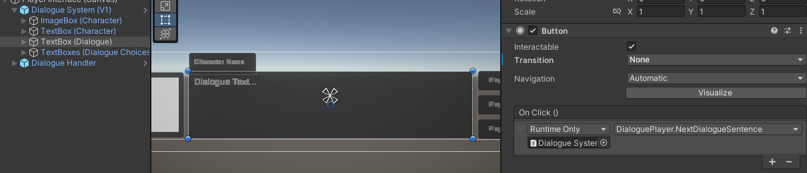
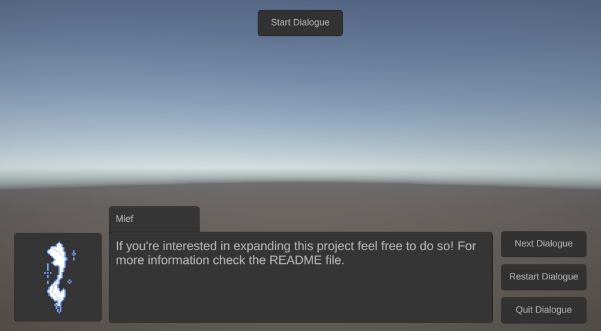
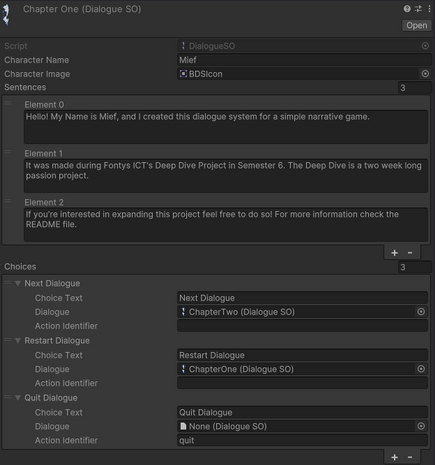

# Basic Dialogue System

## Description
The Basic Dialogue System is a Unity tool designed to provide a non-linear dialogue system for your game. It allows for the creation of dialogue nodes through scriptable objects, enabling multiple choices and event triggers. This system is highly customizable and uses Unity's canvas system.

## Features

- **Creating Dialogue Nodes**: Easily create dialogue nodes using scriptable objects.
- **Non-Linear Dialogue Progression**: Dialogue can progress in a non-linear fashion based on player choices.
- **Multiple Choice**: Present multiple dialogue choices to the player.
- **Event Triggers**: Trigger events based on the dialogue choices made by the player.

### Example Usage

1. **Setup**: Attach the `DialoguePlayer` script to a GameObject in your scene.
2. **Dialogue Handler**: Ensure there is a `DialogueHandler` script in your scene to manage the activation of the dialogue system.
3. **Scriptable Objects**: Create dialogue nodes using the `DialogueSO` scriptable object.
4. **Customization**: Customize your dialogue UI using Unity's canvas system & Scriptable Objects.
5. **Progression**: Sentence progression is done through a canvas button on the `TextBox (Dialogue)`.
  

## Visuals

The Graphic User Interface of the dialogue system showcasing player options at the end of a dialogue chapter.
  

The Dialogue Node (scriptable object) that holds the dialogue of chapter 1.
  

## Support
If you have any questions or would like to know more, feel free to contact me via Teams.

## License
This project is 100% Free & Open-Source. You are free to use, modify, and distribute this software under the terms of the [MIT License](https://opensource.org/licenses/MIT). 

## Project Status
This project is a work in progress (WIP). Contributions and feedback are welcome!
